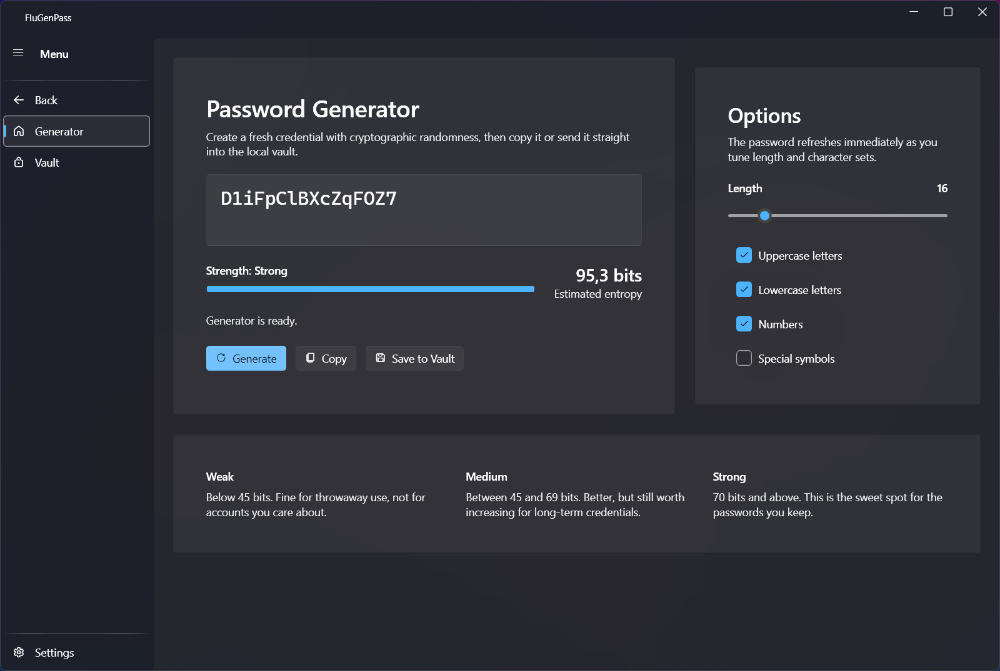
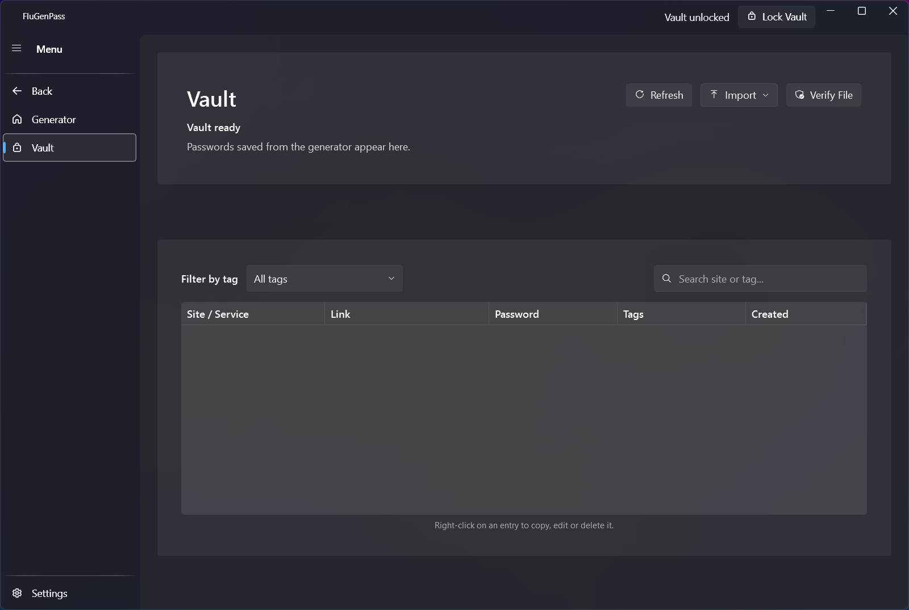
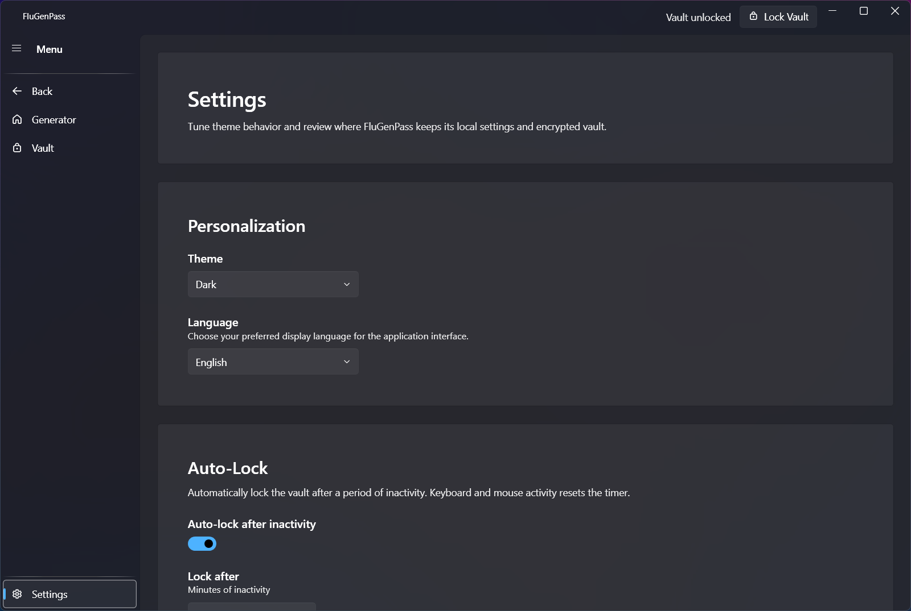

  

<h1 align="center">FluGenPass</h1>

FluGenPass is a modern, user-friendly password manager with a high level of security for Windows (.NET 8). It combines the Fluent UI design philosophy with industry-standard cryptographic protection to ensure the security and accessibility of your credentials.

## Security

FluGenPass is built on a "Zero-Knowledge" architecture. Your master password and key files never leave your device, and your data is only decrypted in memory when you need it.

- **Argon2id KDF**: Uses the winner of the Password Hashing Competition (Argon2id) to derive encryption keys, providing maximum resistance against GPU/ASIC brute-force attacks.
- **Two-Factor Protection (Key File)**: Support for an optional physical Key File. Your vault is encrypted using a composite key derived from both your password AND the file secret.
- **AES-256-GCM Encryption**: Industry-standard authenticated encryption for your vault data.
- **Secure Memory Management**: Sensitive keys and buffers are wiped from RAM using `CryptographicOperations.ZeroMemory` immediately after use.
- **Inactivity Auto-Lock**: Automatically locks your vault after a period of inactivity to prevent unauthorized access.
- **Secure File Erasure**: When resetting or deleting data, FluGenPass overwrites files with random data before deletion to prevent recovery.
- **ECDSA Digital Signatures**: Exported backup files include embedded SHA-256 checksums and ECDSA P-384 signatures for tamper-proof integrity verification.

## Key Features

- **Fluent Design**: Native Windows 11 experience with Mica effect and dynamic theme support (Light/Dark/System).
- **Advanced Vault**: Managed via a professional DataGrid with support for:
  - **Tags**: Organize your secrets with customizable labels.
  - **Live Search**: Instant filtering by site name or tags.
  - **Import/Export**: Easy migration from Bitwarden (CSV) or secure backups with ECDSA signature verification.
  - **Inline Password Editing**: Update the site name, URL, and password directly from the context menu.
  - **Compact Layout**: Optimized row spacing for better information density.
- **Smart Generator**: Create cryptographically strong passwords with entropy indicators and one-click saving.
- **Full Localization**: Native support for **English** and **Russian**.
- **HIBP Leak Check**: Verify if any of your passwords have been exposed in known data breaches.

## Tech Stack

| Category | Technology |
| --- | --- |
| **Language** | C# 12 (.NET 8) |
| **Framework** | WPF (Windows Presentation Foundation) |
| **UI Library** | [WPF-UI](https://github.com/lepoco/wpfui) — Fluent Design controls |
| **Architecture** | MVVM (Model-View-ViewModel) |
| **MVVM Toolkit** | [CommunityToolkit.Mvvm](https://github.com/CommunityToolkit/dotnet) |
| **DI** | Microsoft.Extensions.DependencyInjection |
| **Cryptography** | Argon2id (Konscious.Security.Cryptography.Argon2), AES-256-GCM, ECDSA P-384 |
| **Serialization** | System.Text.Json |
| **CSV** | CsvHelper |
| **Testing** | xUnit, Moq |

## Installation

1. Download the latest `flugenpass-setup.exe` from the [Releases](https://github.com/Zxeroty/FluGenPass/releases) page.
2. Run the installer and follow the instructions.
3. *Requirement*: .NET 8 Desktop Runtime (the installer will help you install it if needed).

## Preview

Click to view application screenshots

### Main Page

### Vault Page

### Settings Page

